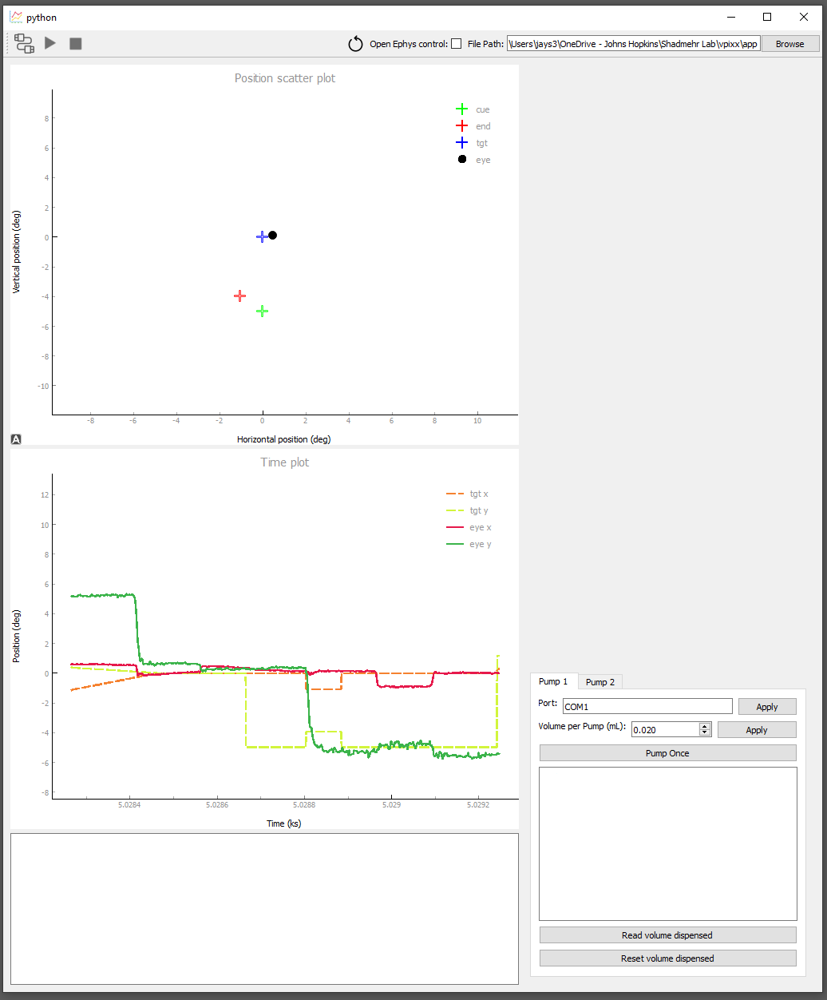
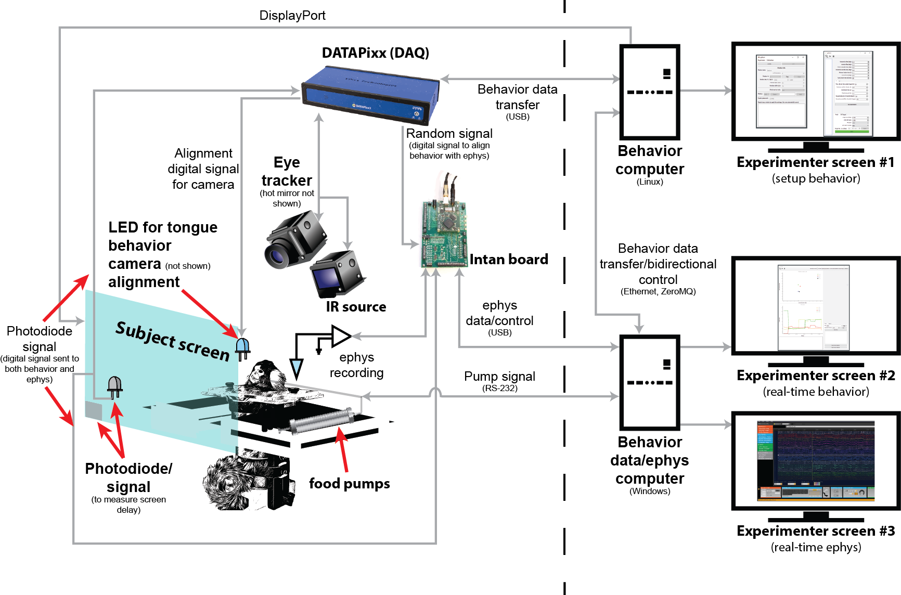
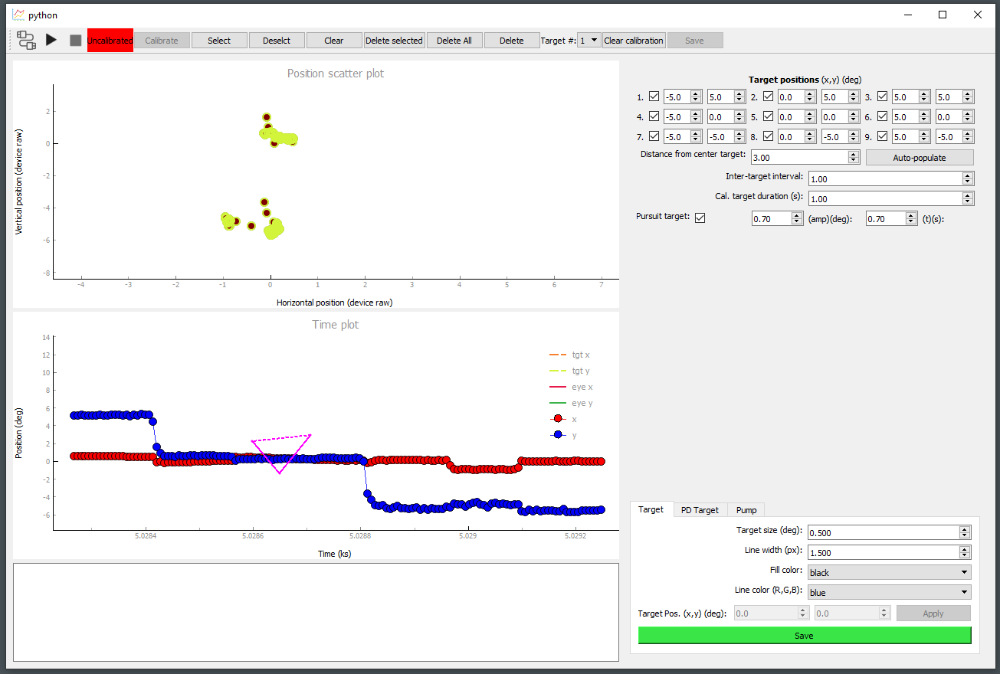
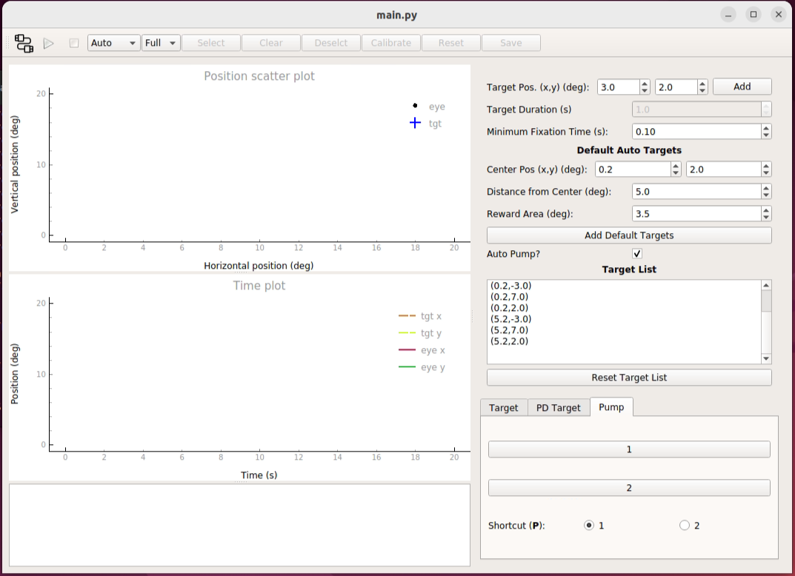
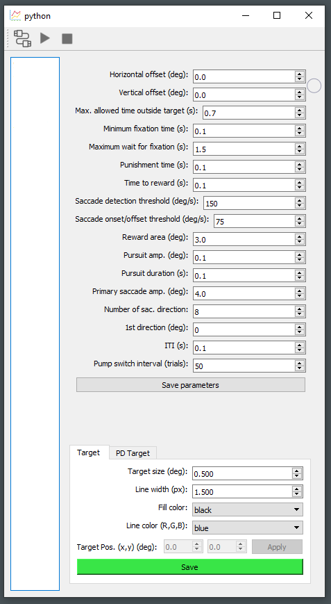
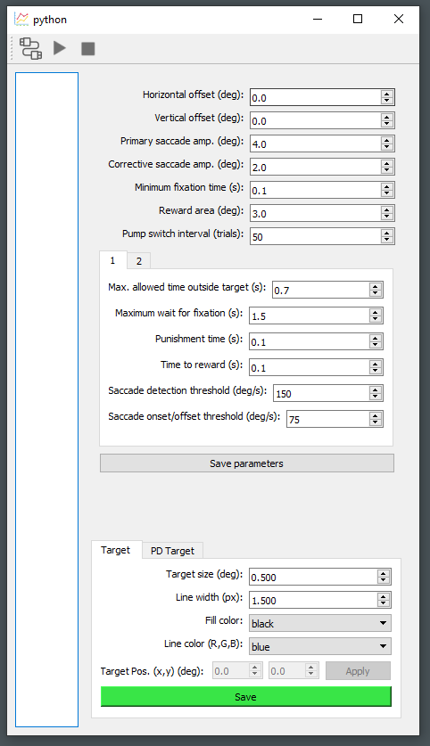

# behavior_app_vpixx
## Open-source software to integrate gaze-contingent behavior experiment for non-human primates with neurophysiology
### behavior_app_vpixx has been developed in [Shadmehr Lab](http://www.shadmehrlab.org/) in Department of Biomedical Engineering at Johns Hopkins University and is being used to conduct eye behavior experiment while recording from cerebellum of marmoset monkeys. Eye tracker device is made by [VPixx Technologies](https://vpixx.com/) (hence the name of repo), and the software is specifically made to interact with it. There is a [companion software](https://github.com/jays314159/behavior_app_eyelink) made for [EyeLink](https://www.sr-research.com/eyelink-1000-plus/) as well.
### More details for any of the information below are found in [user manual](https://github.com/jays314159/behavior_app_vpixx/tree/main/doc/user_manual.pdf).
### While the app. was designed for non-human primates (NHP), it can be used for human subjects as well without any modification. 

# Highlights
- ms-precision real-time gaze-contingent behavior paradigm
- One system clock for the finite-state-machine and I/O
    - Alignment signals for all external devices for an offline conversion to the system clock
    - The constant sampling frequency of the data without variation (2000 Hz in this case)
- 10 ms (3ms SD) screen delay from the time of command to display
    - Verified using photodiode, integrated into the system
- Easy to use manual and semi-auto [calibration tool](#calibration)
    - Proven to work well with non-human primate
    - Able to calibrate each eye separately and choose which eye to track
- Designed to run in conjunction with neurophysiology
    - Integration of random signal to align the data between behavior and ephys times
    - In-app control of [Open Ephys](https://open-ephys.org/), an open-source tool for ephys recordings
- In-app control of peripherals like food pumps, essential for running animal exp.
- Python-based, thus fast and easy to modify and extend
    - Use of open-source graphical library [PsychoPy](https://psychopy.org/index.html) for diverse target options and high performance

# System layout

System consists of two computers to control all aspects of behavior and ephys experiments. This architecture was chosen for maximum performance of the behavior experiment, which requires ms-precise gaze-contingent control of display targets. 

# Software installation
## Behavior computer & Behavior data/ephys computer
1. Install [Anaconda3-2020.11-Windows-x86_64](https://repo.anaconda.com/archive/)
    - It is assumed and highly recommended the following packages are installed in the base environment and the computer used solely for running the experiment.
    - Packages that do not specify versions will list tested versions, but other versions will most likely work
2. In Anaconda prompt, `conda install python=3.8.5`
3. `conda install -c anaconda pyzmq` (tested version: 19.0.2)
4. `pip install psychopy==2021.1.0`
    - Possible errors and solutions:
    > `ERROR: Cannot uninstall 'ruamel-yaml'. It is a distutils installed project and thus we cannot accurately determine which files belong to it which would lead to only a partial uninstall.`
    - In Windows PowerShell, `rd -r "C:\.\anaconda3\Lib\site-packages\ruamel*"` (be sure to use your parant path)
    > `C:\Users\ChamberB_Behavior\anaconda3\lib\site-packages\pyglet\media\codecs\wmf.py:838: UserWarning: [WinError -2147417850] Cannot change thread mode after it is set` `warnings.warn(str(err))` when calling `from psychopy import core, visual, event` for example
    - In Anaconda prompt, `pip install pyglet==1.4.10`
5. In Anaconda prompt, `conda install -c anaconda pyqtgraph` (tested version: 0.11.0)
6. `pip install simpleaudio` (tested version: 1.0.4)
7. `conda install -c anaconda h5py` (tested version: 2.10.0)
8. Install VPixx python library
    - Download and install software package from [VPixx](https://vpixx.com/) after creating account
    - In Anaconda prompt, `pip install -U "(parent path)/pypixxlib.tar.gz"` ; use the most recent 'tar' file
        - For ex., `pip install -U "C:\Program Files\VPixx Technologies\Software Tools\pypixxlib\pypixxlib-3.11.11156.tar.gz"`
    - All development was made in [Spyder](https://docs.anaconda.com/free/anaconda/ide-tutorials/spyder/) IDE; for using VPixx library in this environment to test/debug, "pip install" the library within Spyder command line as well
9. Download the code [repository](https://github.com/jays314159/behavior_app_vpixx)

# Calibration

Eye is cablirated using a 9-point grid pattern of targets. GUI was designed with NHPs in mind, who surprisingly do not behave as we want them to behave, and it was proven to work well with marmoset, which is arguably harder to train than other NHPs like macaques. 

To facilitate calibration for NHPs, you can visualize the eye positions for all the associated targets, and fine-tune the exact positions you want to use for calibration using both scatter plot of x, y positions (top plot) and the eye traces in time (bottom plot) (more details on [user manual]()).

# Refinement

In addition to calibration, the app. has a refinement module where, given a roughly correct calibration, it will fine-tune the parameters automatically presenting sequential fixation targets. The user specifies target parameters.  

# Experiments
The app. currently comes with two ready-made saccadic tasks.
## Simple saccade

### Starting from a fixation point in the center, animal makes a saccades to outward saccades in various directions of certain amplitude. 

## Corrective saccade

### This task is commonly used for eye adaptation. First, a primary target is presented. When animal makes a saccade to that target, we extinguish the primary target and show the secondary target. The goal to induce an *error* at the end of the first saccade. More information on this task is found in some of our lab's published [papers](https://www.shadmehrlab.org/publications).
